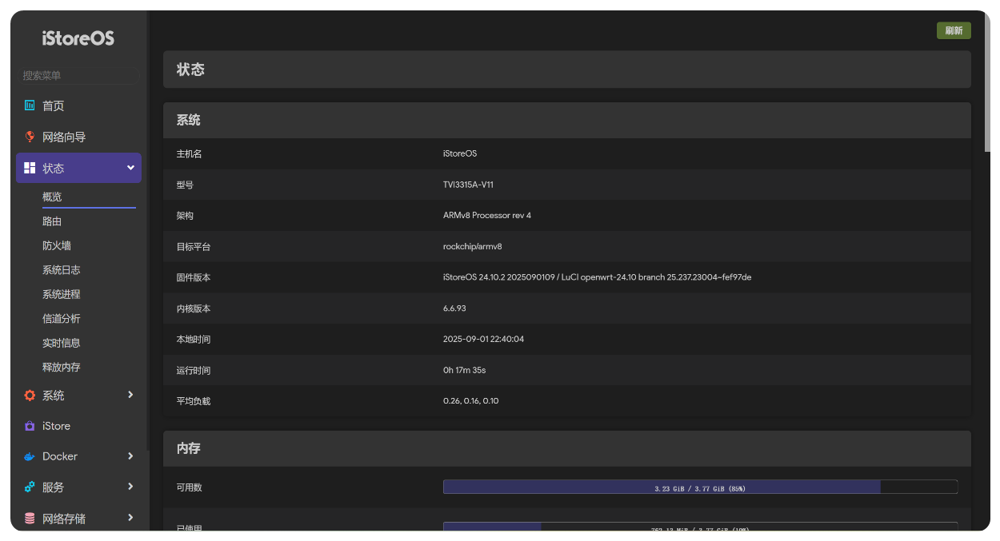

# iStoreOS-Native

# 🤔Introduce
> **🔈 本项目旨在将 RK3399 平台适配至 iStoreOS 官方源码，并通过原生编译构建 `sysupgrade` 格式固件**

> **🔈 RK3399 算是移植中的一块“硬骨头”，只要把它啃下来，其他机型的移植工作基本上就能水到渠成了**

> **😂如果您在适配其他 RK 机型时遇到困难，也欢迎您直接使用这个项目😂👉👉👉[iStoreOS-Actions](https://github.com/Kwonelee/iStoreOS-Actions/releases)**

> **使用此仓库必须设置机密token，Actions云编译固件时需要用到，通常在仓库设置里面。机密键名为 `GH_TOKEN`（严禁在仓库可视代码中填写，否则后果自负）**

# 😅Built-in package plan
| 插件                     | 状态 | 源码地址                                                                   | 备注         |
|:------------------------:|:----:| ------------------------------------------------------------------------- | ------------ |
| ramfree释放内存           | ✅   | [sbwml/openwrt_pkgs](https://github.com/sbwml/openwrt_pkgs)              | 🟢 已测试    |
| FileBrowser文件浏览器     | ✅   | [sbwml/openwrt_pkgs](https://github.com/sbwml/openwrt_pkgs)              | 🟢 已测试    |
| lucky                    | ✅   | [luci-app-lucky](https://github.com/gdy666/luci-app-lucky)               | 🟢 已测试    |
| openlist2                | ✅   | [luci-app-openlist2](https://github.com/sbwml/luci-app-openlist2)        | 🟢 已测试    |
| adguardhome              | ✅   | [w9315273/adguardhome](https://github.com/w9315273/luci-app-adguardhome) ; [sirpdboy/adguardhome](https://github.com/sirpdboy/luci-app-adguardhome) | 🟢 已测试    |
| 其他                     | ⏳   |                                                                          |               |

✅ 支持 ； ⏳ 计划中 ； ❌ 不支持

# 😊Supported devices
| 设备       | 状态   | 包名                                                                    | 备注               |
|:----------:|:------:| ----------------------------------------------------------------------- | ------------------ |
| station-m2 |  ✅    | istoreos-rockchip-armv8-firefly_station-m2-squashfs-sysupgrade.img.gz  | 🟢 已测试          |
| tvi3315a   |  ✅    | istoreos-rockchip-armv8-tvi_tvi3315a-squashfs-sysupgrade.img.gz        | 🟢 已测试          |
| jp-tvbox   |  ✅    | istoreos-rockchip-armv8-jp_jp-tvbox-squashfs-sysupgrade.img.gz         | 🟢 已测试          |
| 其他       |  ⏳    |                                                                         |                    |

✅ 支持 ； ⏳ 计划中 ； ❌ 不支持

# 🤗Screenshot

# 🌟Star戳一戳，好运加满！😆
> **"点过 `Star` 的朋友，颜值与智慧双双在线！✨"**

> **"您的每一个⭐️，都是开源土壤里的一缕阳光，让灵感发芽，让创造生长~"**

# 🙏Thanks
- [istoreos](https://github.com/istoreos/istoreos)
- [linux-6.6.y](https://github.com/unifreq/linux-6.6.y)
- [Actions-iStoreOS-RK35XX-24.10](https://github.com/xiaomeng9597/Actions-iStoreOS-RK35XX-24.10)

# ⚠️免责声明
- 本固件仅供学习研究，请勿用于商业用途
- 使用本固件所带来的一切后果由使用者自行承担
- 不保证完全无 bug，开发者不提供定制支持
- 请遵守国家网络安全相关法律法规
